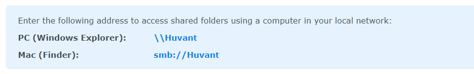
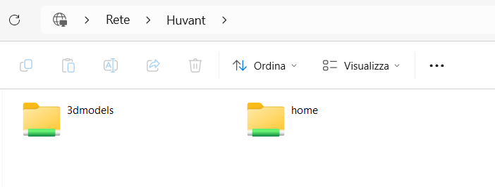
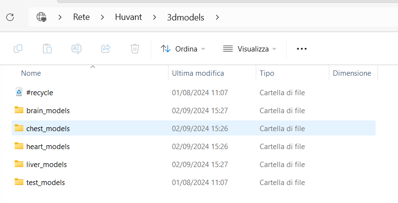
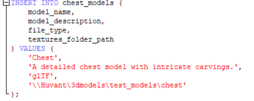

Come parte della configurazione del NAS Synology DiskStation DS723+, è stato creato un sistema di archiviazione sicuro per proteggere i dati sensibili. All'interno di questo sistema, è stata organizzata una struttura gerarchica con una cartella principale chiamata "3dmodels". Questa cartella funge da contenitore principale per diverse sottocartelle, ognuna dedicata a specifici tipi di modelli 3D, come "chest_models", "heart_models", e altre che possono essere aggiunte o modificate in base alle necessità del progetto.

## Collegamento al NAS dal File Explorer di Windows/MAC

### 1. **Preparazione e Prerequisiti**

   Prima di procedere con il collegamento al NAS, assicurarsi di avere:

   - Un PC Windows/MAC connesso alla stessa rete del NAS.
   - Credenziali di accesso al NAS (nome utente e password).
   - Permessi di accesso alla cartella condivisa sul NAS.

### 2. Mappatura del NAS su Windows come Unità di Rete

1. **Aprire Esplora Risorse**: Fare clic sull'icona di Esplora Risorse (Cartella) sulla barra delle applicazioni di Windows.

2. **Navigare a "Questo PC"**: Fare clic su "Questo PC" nel pannello sinistro.

3. **Mappare l'Unità di Rete**:
   - Cliccare su **Computer** nella barra in alto, quindi su **Mappa unità di rete**.
   - Nella finestra che si apre, selezionare una lettera per l’unità (es. `Z:`).
   - Nel campo **Cartella**, inserire l'indirizzo o nome del NAS e la cartella condivisa, ad esempio: `\\Huvant\3dmodels`.
   - Spuntare **Riconnetti all'accesso** se si desidera mantenere la connessione ogni volta che il PC si avvia.

4. **Autenticazione**: Inserire le credenziali utente del NAS quando richiesto.

5. **Conferma**: Fare clic su **Fine**. Ora la cartella condivisa sul NAS sarà visibile come un'unità di rete.

 

Windows Explorer: 

### 3. Salvare i File sul File System del NAS
Una volta mappata l'unità, aprire l’unità di rete dal pannello di “Questo PC”.
È possibile trascinare e rilasciare i file direttamente nell'unità di rete per sfruttare l’archiviazione del NAS.
I PC locali gestiranno la creazione, il rendering, e altre operazioni sui file, sfruttando così la loro potenza di calcolo, mentre il NAS fungerà da deposito centralizzato.

**Nota Bene: Il file system può essere modificato in qualsiasi momento in base alle esigenze, a condizione di avere le credenziali e i permessi necessari (amministratore). Inoltre, la cartella "textures" di ogni modello sarà utilizzata come percorso per popolare il database "3dmodels", poiché si desidera tenere traccia dei modelli. Esempio:**

