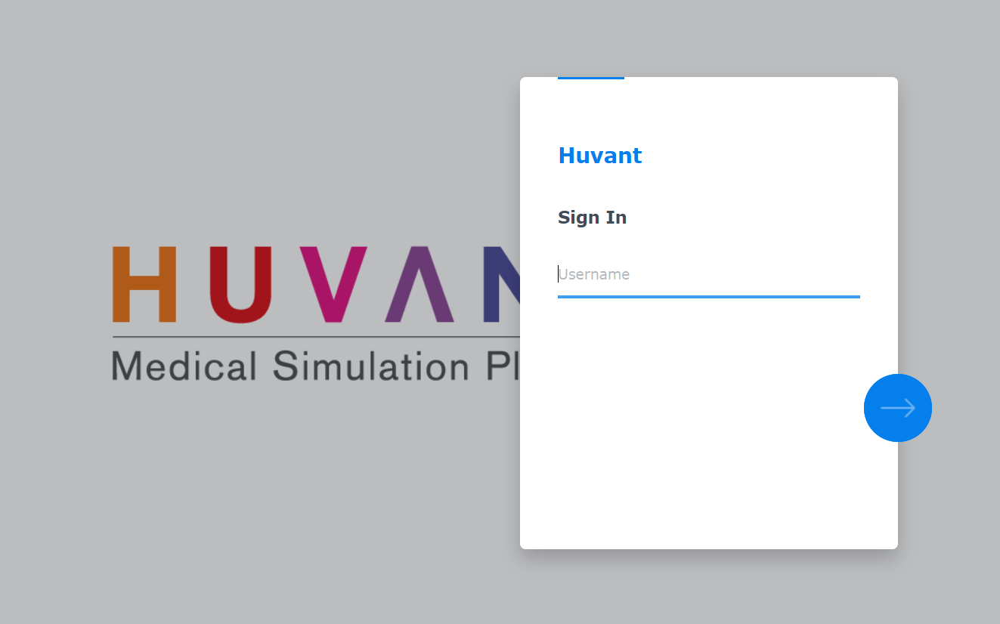
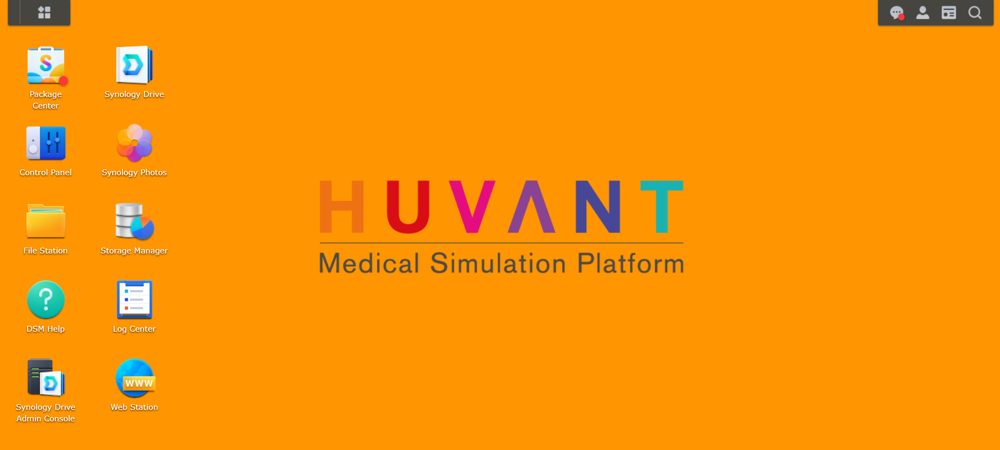
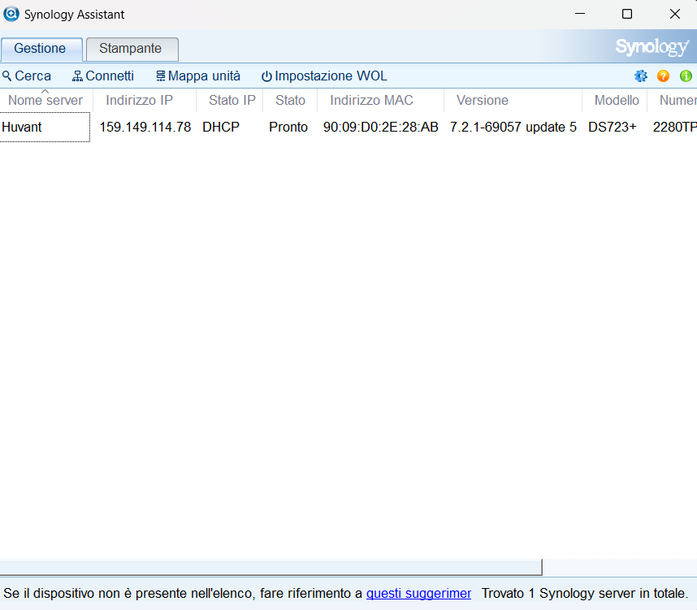
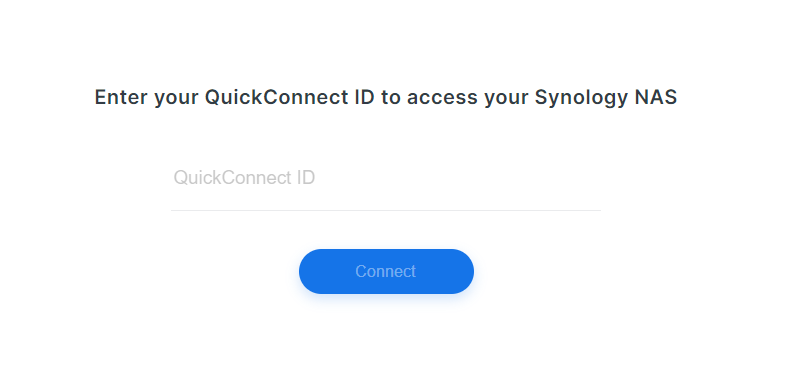
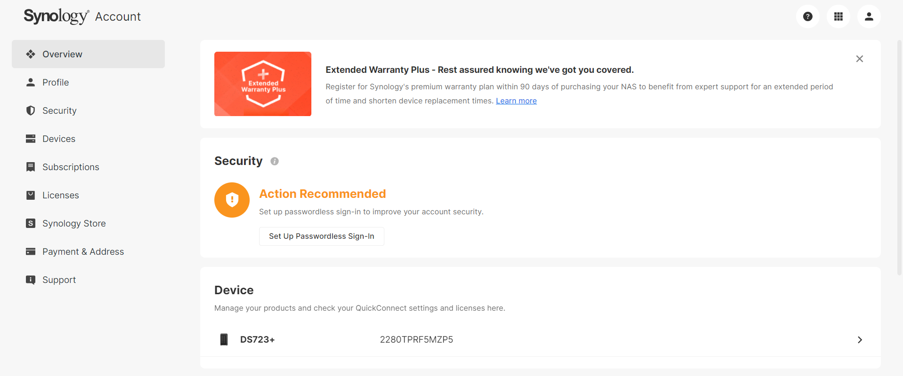

### Panoramica Generale su DSM, RAID e NAS Synology

L'installazione e l'avvio del NAS Synology DiskStation DS723+ iniziano con la connessione hardware, inserendo i dischi rigidi negli slot disponibili e collegando il NAS alla rete tramite cavo Ethernet. Successivamente, si accede all'interfaccia di gestione tramite un browser web utilizzando [find.synology.com](https://find.synology.com) o l'indirizzo IP assegnato al NAS. Durante la configurazione iniziale, viene installata l'ultima versione del sistema operativo Synology DiskStation Manager (DSM) e si definiscono le impostazioni di base come il nome del NAS (es. "Huvant") e le credenziali amministrative. Si procede quindi alla creazione del volume di storage (es. "storage pool 1 - Huvant") e alla configurazione del RAID (es. SHR), assicurando una gestione ottimale dei dati.

#### Synology DiskStation Manager (DSM)

- **Cos'è DSM?**
  - DSM, acronimo di DiskStation Manager, è il sistema operativo utilizzato dai NAS (Network Attached Storage) Synology. 
  - DSM offre un'interfaccia intuitiva e user-friendly accessibile via browser web che permette di gestire il NAS, configurare dischi, condividere file, impostare backup e molto altro.

- **Funzionalità Principali:**
  - **Gestione File:** Fornisce strumenti avanzati per organizzare, condividere e accedere ai file da diversi dispositivi.
  - **Backup e Ripristino:** Integra soluzioni per backup automatizzati e ripristino dei dati, proteggendo contro la perdita di informazioni.
  - **Sicurezza:** Include opzioni avanzate per la sicurezza dei dati come crittografia, antivirus integrato e autenticazione a due fattori.
  - **Applicazioni di Terze Parti:** Supporta un ampio ecosistema di applicazioni aggiuntive, come server multimediali, strumenti di collaborazione e software di videosorveglianza.

  
 
Huvant DSM:

  

#### RAID (Redundant Array of Independent Disks)

- **Cos'è RAID?**
  - RAID è una tecnologia che consente di combinare più dischi rigidi per migliorare le prestazioni, aumentare la capacità di storage e garantire la protezione dei dati. Esistono diversi livelli di RAID, ognuno con specifiche caratteristiche di ridondanza e prestazioni.

- **RAID SHR (Synology Hybrid RAID):**
  - SHR è una versione proprietaria di RAID sviluppata da Synology che semplifica la configurazione dei dischi e offre una protezione flessibile dei dati.
  - **Vantaggi di SHR:**
    - **Ridondanza dei Dati:** Protegge i dati anche se uno dei dischi si guasta.
    - **Espansione Flessibile:** Permette di aggiungere dischi di diverse dimensioni senza perdere spazio.
    - **Facilità di Configurazione:** SHR automatizza la configurazione e manutenzione del RAID, rendendola adatta anche a utenti meno esperti.

#### NAS Synology DiskStation DS723+

- **Cos'è un NAS?**
  - Un NAS (Network Attached Storage) è un dispositivo di storage collegato alla rete locale che consente di archiviare, condividere e gestire file centralmente. Il NAS è accessibile da qualsiasi dispositivo connesso alla rete, come computer, smartphone e tablet.

- **Funzionalità del NAS Synology DS723+:**
  - **Connettività di Rete:** Collega il NAS alla rete locale tramite cavo Ethernet per garantire l'accesso ai dati da vari dispositivi.
  - **Archiviazione Centrale:** Consolida dati e backup in un unico dispositivo sicuro e facile da gestire.
  - **Accesso Remoto:** Consente di accedere ai file anche da remoto tramite servizi cloud integrati.
  - **Espandibilità:** Permette di espandere lo spazio di archiviazione aggiungendo ulteriori dischi.

### Metodi di Connessione al NAS Synology: Synology Assistant e QuickConnect

Il NAS Synology può essere configurato e gestito attraverso diversi metodi di connessione che facilitano l’accesso da diverse piattaforme e da qualsiasi luogo. I due metodi principali per accedere al NAS sono tramite Synology Assistant e QuickConnect. Di seguito viene spiegato come funzionano entrambi i metodi.

#### 1. Connessione tramite Synology Assistant

**Cos'è Synology Assistant?**
- Synology Assistant è un software gratuito sviluppato da Synology che aiuta a trovare e collegarsi al NAS sulla rete locale. È disponibile per sistemi operativi Windows, macOS e Linux.

**Come collegarsi al NAS tramite Synology Assistant:**
1. **Scarica e installa Synology Assistant:**
   - Scarica il software dal [sito ufficiale di Synology](https://www.synology.com/it-it/support/download) e installalo sul tuo computer.

2. **Rileva il NAS sulla rete locale:**
   - Avvia Synology Assistant. Il programma rileverà automaticamente i dispositivi Synology collegati alla stessa rete del computer.
   - L'elenco mostrerà il nome del NAS, l'indirizzo IP, lo stato e altre informazioni rilevanti.

3. **Accesso al NAS:**
   - Seleziona il NAS rilevato dall’elenco e clicca su “Connetti”. Questo ti reindirizzerà al DSM (DiskStation Manager) tramite il browser web.
   - Inserisci le credenziali amministrative (nome utente e password) per accedere all'interfaccia di gestione.

   

**Vantaggi di Synology Assistant:**
- Facilita il rilevamento e l'accesso al NAS senza la necessità di conoscere l’indirizzo IP.
- Ideale per la configurazione iniziale e la gestione su reti locali.
  
#### 2. Connessione tramite QuickConnect

**Cos'è QuickConnect?**
- QuickConnect è un servizio di Synology che permette di accedere al NAS da remoto senza dover configurare manualmente impostazioni di rete complesse come IP statici, port forwarding o DNS dinamici. QuickConnect utilizza un link univoco per accedere al NAS da qualsiasi luogo con una connessione a Internet.

**Come collegarsi al NAS tramite QuickConnect:**

2. **Accedere al NAS tramite il link QuickConnect:**
   - Utilizza il link QuickConnect fornito in privato per accedere al NAS da qualsiasi browser.
   - Inserisci le credenziali amministrative per accedere all'interfaccia DSM.

   **Importante:**
   Per far sì che QuickConnect funzioni correttamente, il NAS deve essere **acceso** e **collegato alla rete Internet**. Senza una connessione Internet attiva o se il NAS è spento, QuickConnect non sarà in grado di stabilire il collegamento remoto.

**Vantaggi di QuickConnect:**
- **Accesso Remoto Senza Configurazioni Complesse:** Permette di collegarsi al NAS da qualsiasi luogo senza preoccuparsi della configurazione della rete.
- **Sicurezza:** QuickConnect utilizza protocolli di sicurezza avanzati per proteggere la connessione e i dati durante l'accesso remoto.
- **Facilità di Utilizzo:** Fornisce un accesso facile e rapido per gestire file, eseguire backup, e accedere a servizi multimediali senza configurazioni aggiuntive.

   

### Conclusione

Entrambi i metodi di connessione – tramite Synology Assistant e QuickConnect – offrono un accesso semplice e sicuro al NAS Synology, con Synology Assistant ottimizzato per l'uso in rete locale e QuickConnect ideale per l'accesso remoto. Questi strumenti consentono agli utenti di sfruttare al massimo le funzionalità del NAS in modo efficiente e senza problemi tecnici complessi.

### Synology Account

