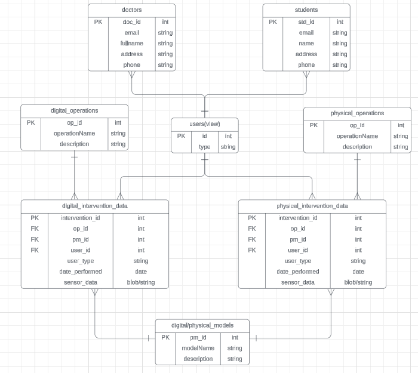

---

Il database chiamato **"operations"** è stato creato utilizzando MySQL per raccogliere, gestire e analizzare i dati delle operazioni svolte sia tramite visori che con prove pratiche. I dati rilevati dai sensori possono essere memorizzati nel database in modo organizzato e sicuro.

Abbiamo scelto MySQL perché è una tecnologia che ci è sembrata adatta alle vostre esigenze, facile da usare e pratica.

L'obiettivo principale del database **"operations"** è di conservare i dati raccolti per facilitare l'analisi e il monitoraggio delle performance degli studenti. Ogni dato viene salvato con dettagli specifici, come:

- L'identificativo dell'intervento
- L'identificativo dell'operazione
- L'identificativo del modello (cioè la parte o organo su cui si lavora)
- L'identificativo dell'utente
- Il momento in cui il dato è stato registrato

---
Modello:

---

### **doctors**
- **Descrizione**: Contiene le informazioni sui medici.
- **Campi**:
  - **ID medico**: Un numero che identifica il medico.
  - **Email**: L'indirizzo email del medico.
  - **Nome completo**: Il nome e cognome del medico.
  - **Indirizzo**: L'indirizzo di casa o dell'ufficio del medico.
  - **Telefono**: Il numero di telefono del medico.

### **students**
- **Descrizione**: Contiene i dati degli studenti.
- **Campi**:
  - **ID studente**: Un numero che identifica lo studente.
  - **Email**: L'indirizzo email dello studente.
  - **Nome**: Il nome dello studente.
  - **Indirizzo**: L'indirizzo di casa dello studente.
  - **Telefono**: Il numero di telefono dello studente.

### **digital_operations**
- **Descrizione**: Contiene le informazioni sulle operazioni digitali.
- **Campi**:
  - **ID operazione**: Un numero che identifica l'operazione digitale.
  - **Nome operazione**: Il nome dell'operazione.
  - **Descrizione**: Una breve descrizione dell'operazione.

### **physical_operations**
- **Descrizione**: Contiene le informazioni sulle operazioni fisiche.
- **Campi**:
  - **ID operazione**: Un numero che identifica l'operazione fisica.
  - **Nome operazione**: Il nome dell'operazione.
  - **Descrizione**: Una breve descrizione dell'operazione.

### **digital_intervention_data**
- **Descrizione**: Raccoglie i dati sulle operazioni digitali, inclusi i dati dei sensori.
- **Campi**:
  - **ID intervento**: Un numero che identifica l'intervento.
  - **ID operazione**: Identifica l'operazione digitale collegata.
  - **ID modello**: Identifica il modello usato nell'intervento.
  - **ID utente**: Identifica chi ha eseguito l'intervento (medico o studente).
  - **Tipo utente**: Specifica se l'utente è un medico o uno studente.
  - **Data**: La data in cui è stato fatto l'intervento.
  - **Dati sensori**: I dati raccolti dai sensori durante l'intervento.

### **physical_intervention_data**
- **Descrizione**: Raccoglie i dati sulle operazioni fisiche, compresi i dati sensoriali.
- **Campi**:
  - **ID intervento**: Un numero che identifica l'intervento fisico.
  - **ID operazione**: Identifica l'operazione fisica collegata.
  - **ID modello**: Identifica il modello usato nell'intervento.
  - **ID utente**: Identifica chi ha eseguito l'intervento (medico o studente).
  - **Tipo utente**: Specifica se l'utente è un medico o uno studente.
  - **Data**: La data dell'intervento.
  - **Dati sensori**: I dati raccolti dai sensori durante l'intervento.

### **digital/physical_models**
- **Descrizione**: Contiene i modelli utilizzati sia nelle operazioni digitali che fisiche.
- **Campi**:
  - **ID modello**: Un numero che identifica il modello.
  - **Nome modello**: Il nome del modello.
  - **Descrizione**: Una descrizione del modello.

### **users (view)**
- **Descrizione**: Unione delle informazioni di medici e studenti, utile per vedere tutti gli utenti insieme.
- **Campi**:
  - **ID utente**: Identifica l'utente.
  - **Tipo**: Specifica se l'utente è un medico o uno studente.

---