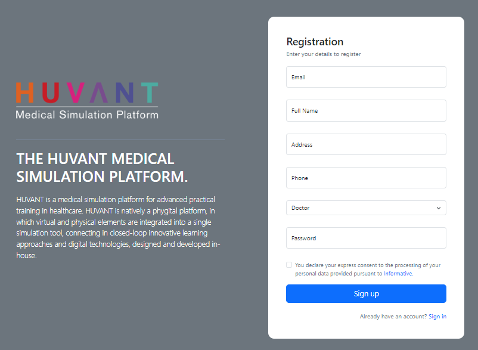
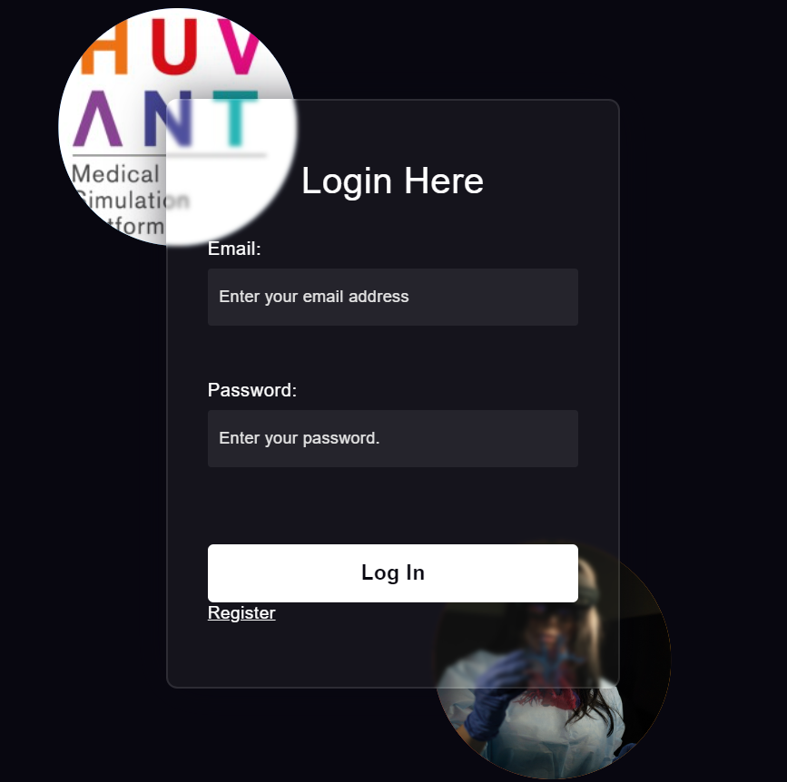

La pagina **"Sign Up"** permette agli utenti di registrarsi inserendo le loro informazioni personali e creando un nuovo account nel database. La pagina **"Login"** consente invece agli utenti già registrati di accedere in modo sicuro ai servizi, verificando le loro credenziali.

Queste pagine sono state progettate principalmente per testare e popolare il database "operations". Tuttavia, per una maggiore sicurezza, si consiglia di integrare nel sito WordPress solo la parte grafica delle pagine (HTML e CSS), mentre la parte di gestione dei dati (backend) dovrebbe essere ricostruita con un linguaggio di programmazione più sicuro. Questo perché l'applicazione originale, sviluppata con Node.js e Express.js, non offre un livello di sicurezza adeguato per proteggere i dati sensibili degli utenti.

1. Panoramica dell'Integrazione
Le pagine "Sign Up" e "Login" sono state sviluppate con Node.js e Express.js per testare e popolare il database "operations". Tuttavia, queste pagine non gestiscono al meglio la sicurezza dei dati e devono essere utilizzate solo per scopi grafici e non gestionali.

2. Pre-requisiti
Accesso al server dove è ospitato WordPress.
Accesso al codice delle pagine sviluppate in Node.js + Express.js.
Conoscenza di HTML, CSS, PHP e le basi di WordPress.

3. Passi per Integrare le Pagine di Sign Up e Login con WordPress

**Step 1: Preparazione dell'Ambiente**
Verificare che il sito WordPress e l’applicazione Node.js siano ospitati sullo stesso server o su server connessi tra loro.
Assicurarsi che Node.js sia configurato correttamente e che l’applicazione Express.js funzioni senza errori.

**Step 2: Creazione delle Pagine Custom su WordPress**
Creare due nuove pagine su WordPress: una per il "Sign Up" e una per il "Login". Questa operazione può essere effettuata accedendo al backend di WordPress e andando su Pagine > Aggiungi nuova.
Assegnare un URL univoco a ciascuna pagina, ad esempio /signup e /login.

**Step 3: Incorporazione del Frontend HTML e CSS**
Copiare il codice HTML e CSS delle pagine di "Sign Up" e "Login" (escludendo il codice JavaScript lato server).
Incollare il codice HTML nella sezione di contenuto della pagina WordPress corrispondente, utilizzando l’editor a blocchi e selezionando un blocco HTML personalizzato.
Aggiungere il CSS direttamente nell'area di modifica della pagina, tramite l'editor di tema, o utilizzando un plugin come "Simple Custom CSS" per inserire gli stili personalizzati.

**Step 4: Configurazione del Backend Node.js + Express.js**
Configurare il server Node.js per gestire le richieste relative al login e alla registrazione.
Verificare che il server Node.js sia configurato per accettare richieste da WordPress, impostando correttamente i CORS (Cross-Origin Resource Sharing) per consentire richieste dal dominio WordPress.

**Step 5: Creazione di API REST per l’Integrazione**
Esporre API REST per le funzionalità di "Sign Up" e "Login":
Endpoint /api/signup per la registrazione.
Endpoint /api/login per il login.
Garantire che le API restituiscano risposte in formato adeguato (es. JSON) per essere gestite dal frontend.

**Step 6: Integrazione Frontend-Backend tramite JavaScript**
Integrare il JavaScript lato client per inviare richieste AJAX alle API Node.js:
Utilizzare fetch() o axios per inviare i dati del form agli endpoint /api/signup e /api/login.
Implementare la gestione degli errori e delle risposte per visualizzare messaggi di errore o di successo agli utenti in base alle risposte ricevute dalle API.

**Step 7: Configurazione della Sicurezza e Limitazioni**
Impostare restrizioni di accesso a queste pagine su WordPress, se necessario, utilizzando plugin di sicurezza per nasconderle dai motori di ricerca.
Inserire avvisi agli utenti, specificando che le pagine sono state progettate solo per scopi dimostrativi o interni, poiché non gestiscono la sicurezza al massimo livello.

**Step 8: Test Completo e Debug**
Eseguire test completi delle funzionalità di "Sign Up" e "Login", verificando che la comunicazione tra WordPress e il server Node.js avvenga correttamente.
Assicurarsi che le richieste siano gestite in modo sicuro e che i dati sensibili non siano esposti.

Sign Up: 

Login:

